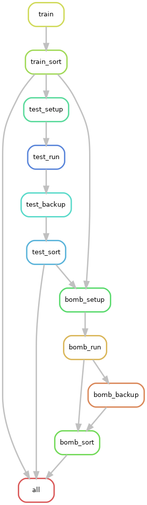

# Irreversible_plasticity
Irreversible_plasticity project  
A. Rago and M. Brun-Usan

## Workflow
Briefly, we compile each simulation using the same development and grns2 files, but changing the start file, which specifies simulation parameters.
Each individual simulation includes 5 steps:
* Setup: retrieves and lists source GRNs, compiles executables
(testing simulations only)
* Run: executes the simulations
* Sort: moves the results to storage directories and cleans up binaries
* Bomb: mutates all GRNs produced by a the simulation
* Bomb sort: moves mutated GRNs to storage directory

I am currently implementing step 6: converting the output of bombs to a more compact file that only stores phenotypes at each environment (and their fitness).

Please note that in order to avoid multiple parallel processes accessing the same files and folder we need to run snakemake with the options:

`snakemake --resources GRNfile=1 -w 600`



## Program structure
Each individual simulation is compiled from 3 main files:  

* start: Declares most variables used in simulation
* development: Contains developmental loop for each individual
* grns2: Contains evolutionary loop (fitness evaluation, mutation etc)

Calls start for global parameters and development for each individual.

## Compiling files
We use the f90 FORTRAN compiler, available by default on most LINUX distributions.  
Each simulation is compiled immediately before running via snakemake workflow.
Check individual rules for specifics.

## Manual input options

If option training = 0, loads pre-trained networks specified by name in start file (lines 92+).  
If option mzadhoc = 1, loads manually specified hidden to phenotype matrices from /files/mzadhoc.dat  
Matrix format is rows = genes, columns = traits.
The first rows specify the continuous connection weights, followed by the discrete presence/absence connection data.  

## Output file format
The program produces 2 types of files:  
Gene regulatory network files (prefix GRN) contain the machine-readable simulation parameters and the matrices necessary to re-load each individual GRN produced during the simulation.  
Phenotype files (prefix PHE) contain the phenotypes and fitness of each individual in every generation recorded.

### GRN files
Running the pipeline generates GRN files in the following format:  
GRN_TARGET_THRESHOLD_REPLICATE_TIME_TARGET1_REPLICATE1_TIME1.dat  
Where GRN is the file identifier  
TARGET is a string of integers which identifies the multivariate targets in format E1T1E1T2ENT1ENT2  
THRESHOLD is an integer stating in which cell the target E1T1E1T2 switches to ENT1ENT2  
TIME is an integer describing which simulation checkpoint is recorded  
REPLICATE is an integer which denotes the unique ID of the random replicates (random seed)  
The latter part of the string contains the name of the file which we load the initial population from, or BLANK in case the simulation is initiated from empty networks  

Content is formatted as a ascii file with commented header which records the following simulation parameters:  

```
     'TARGETS (E1T1,E1T2,ENT1,ENT2)',block(1:2,1), block(1:2,n)  ! 1  
     'THRESHOLDS(CELL).............',thresholds(1)               ! 2  
     'POPULATON SIZE...............',p                           ! 3  
     'STRENGHT OF SELECTION........',ss                          ! 4  
     'RECOMBINATION; 1=YES; 0=NO   ',reco                        ! 5  
     'TRAINING (1) vs TEST (0) SET ',training                    ! 6  
     'NUMBER /  TOTAL REPLICATES...',replica,replicas            ! 7  
     'CURRENT VS MAXIMUM GENERATION',et,etmax,lapso              ! 8  
     'ENV. FACTORS/ENVIRONMENTS....',EF,n                        ! 9  
     'NUMBER GENES,PHEN. DIMENSIONS',ng,PD                       ! 10  
     'TMAX,SDEV,SS,RECO,CAPPED.....',tmax,sdev,ss,reco,capped    ! 11   
     'CONNECTIVITIES WW / MZZ .....',conWW,conMZZ                ! 12   
```

Following the header the file records, for each individual, the W (weights) and WW (discrete connection) matrices for the hidden layer. Connection matrices are stacked across all individuals recorded in the simulation (rbind).  
At the end of the file there are written the (non-mutable) MZ and MZZ matrices, which are the same for all individuals.
Every matrix written is tab separated.

### PHE files
Phenotype files are tab separated annotations of the phenotype of every individual of the population, at each time step and in every environment.  
Each row represents an individual of a population at a given time step in a given environment. NOTE: Individuals change between generations: individual IDs are only used to distinguish between individuals of the same generation.   
Columns are annotated as follows:  

```
"Replicate"      Integer, ID of the simulation replicate  
"Generation"     Integer, Number of generations since the simulation start  
"Individual"     Integer, ID of the individual in the population.  
"Environment"    Integer, ID of the environment the organism is exposed to  
"Trait"          Integer, ID of the trait whose value is shown in column "Phenotype"  
"Phenotype"      Continuous real, numeric value of the trait annotated in column "Trait"  
"Fitness"        Continuous real, average fitness value of the individual across ALL environments
```

## File storing.

The program uses/requires a folder called "files" located in the same directory.
The files directory stores the manually specified output layer ('mzadhoc') and the source GRN files used to initialize testing simulations.
The results of simulations are moved into the `../Simulation_results` directory.
Each training problem is saved in its own directory named after the training problem test.
The folder also includes a subfolder for the results of mutational bombs.
